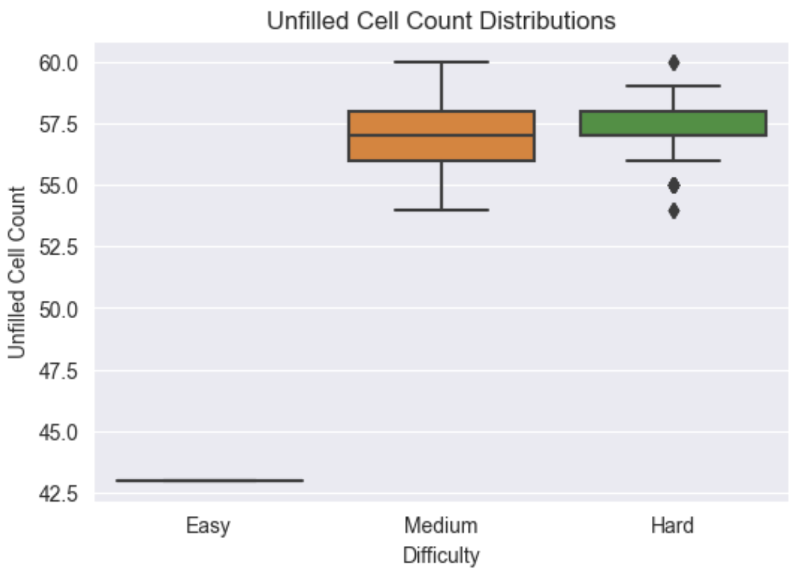
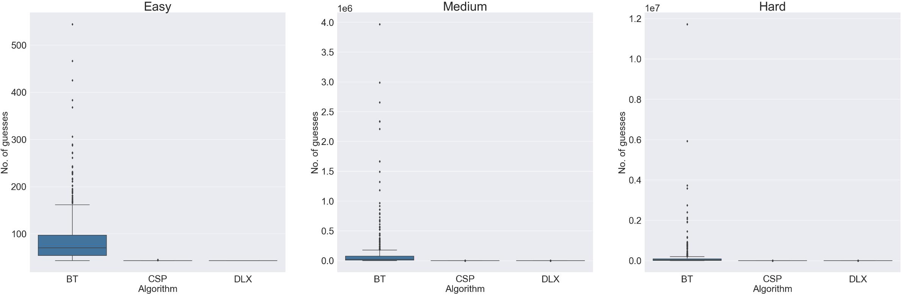
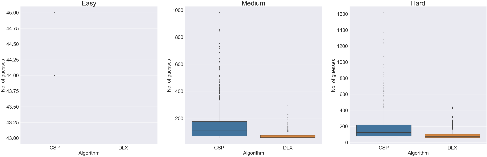

# Sudoku-AI
This repository is a collection of implementations and comparisons of algorithms to solve the classic 9x9 Sudoku.

## Directory Structure
- `algorithms`
    - `bt.py`: Simple backtracking (BT)
    - `csp.py`: Constraint Satisfaction Problem (CSP)
    - `dlx.py`: Dancing Links Algorithm X (DLX)
    - `lp.py`: Linear Program (LP)
    - `sat.py`: Boolean Satisfiability Problem (SAT)
- `data`
    - `scraping.gs`: Scraping code
    - `NYTimes_Sudoku_Dataset.csv`: Scraped NYTimes Sudoku dataset
- `comparison.ipynb`: Algorithm comparisons code

## Datasets
The algorithms (BT, CSP, DLX) are compared in two settings.
### [NYTimes Sudoku Dataset](data/NYTimes_Sudoku_Dataset.csv)
NYTimes publishes easy, medium, and hard classic 9x9 Sudokus daily. The website is scraped to prepare a Sudoku dataset using [Google Apps Script](data/scraping.gs). The script is setup to automatically update a Google Sheet daily.

As of May 11th, 2023, the dataset contains 711 Sudokus for each difficulty, with the following unfilled cell count distributions.

As expected, medium and hard Sudokus have larger unfilled cell counts compared to easy Sudokus. But interestingly, medium and hard Sudokus have similar unfilled cell counts. This suggests that the key factor separating medium from hard Sudokus is the arrangement of unfilled cells (as opposed to their count).

### AI Escargot (*"The Most Difficult Sudoku Puzzle"*)
In November 2006, Arto Inkala, a Finnish applied mathematician, claimed to have created the world's hardest Sudoku. He said *"I called the puzzle AI Escargot, because it looks like a snail. Solving it is like an intellectual culinary pleasure. AI are my initials"*, and *"Escargot demands those tackling it to consider eight casual relationships simultaneously, while the most complicated variants attempted by the public require people to think of only one or two combinations at any one time"*. The following figure shows the Sudoku.

## Algorithms
- [**Simple Backtracking (BT)**](algorithms/bt.py): Simple backtracking is perhaps the simplest sudoku solving algorithm and serves as a baseline. It entails iterating over the sudoku grid and assigning valid values to unfilled cells (a value is considered valid if there is no other cell with the same value in the row/column/3x3 box of the given cell). In case assignments lead to an unfeasible scenario, the algorithm backtracks and attempts alternative assignments to the unfilled cells.

- [**Constraint Satisfaction Problem (CSP)**](algorithms/csp.py): Simple backtracking can be enhanced when modelling the sudoku as a [constraint satisfaction problem (CSP)](https://en.wikipedia.org/wiki/Constraint_satisfaction_problem). Of particular significance is the *Maintaining Arc Consistency (MAC) algorithm*, which trims the set of possible values for other unfilled cells whenever an unfilled cell is assigned. Additionally, the algorithm can be made more efficient using the *minimum-remaining-values (MRV) heuristic* (assign the next value to the unfilled cell with the fewest possible values), the *degree heuristic* (assign the next value to the unfilled cell that is involved in the highest no. of constraints with other unfilled cells), and the *least-constraining-value heuristic* (assign the next value that yields the highest number of consistent values of neighboring cells) (see for reference Chapter 6 of Russell, S. J., Norvig, P., & Davis, E. (2010). Artificial intelligence: a modern approach. 3rd ed. Upper Saddle River, NJ: Prentice Hall).

- [**Algorithm X (DLX)**](algorithms/dlx.py): The Sudoku can be modelled as an [exact cover problem](https://en.wikipedia.org/wiki/Exact_cover), which lends itself to solving using the [dancing links](https://en.wikipedia.org/wiki/Dancing_Links) implementation of [Donald Knuth's Algorithm X](https://en.wikipedia.org/wiki/Knuth%27s_Algorithm_X) (see for reference [here](https://arxiv.org/pdf/cs/0011047.pdf)).

- [**Linear Program (LP)**](algorithms/lp.py): The Sudoku can be modelled as a [linear program](https://en.wikipedia.org/wiki/Linear_programming), which lends itself to solving using the Python [PuLP package](https://coin-or.github.io/pulp/CaseStudies/a_sudoku_problem.html).

- [**Boolean Satisfiability Problem (SAT)**](algorithms/sat.py): The Sudoku can be modelled as a [boolean satisfiability problem](https://en.wikipedia.org/wiki/Boolean_satisfiability_problem), which lends itself to solving using the Python [pycosat package](https://github.com/conda/pycosat/blob/main/examples/sudoku.py) (see for reference [here](https://www.lri.fr/~conchon/mpri/weber.pdf)).

## Comparisons
### NYTimes Sudoku Dataset
The following figure shows the distributions of the no. of guesses made by each algorithm. There is one plot for each difficulty level. Within each plot, separate plots are provided for each algorithm.

Given that the BT algorithm dominates the plots, the following figure shows the distributions after excluding this algorithm.

Finally, the following table shows the average no. of guesses for each case.

<table>
    <tr>
        <th>Difficulty</th>
        <th>Algorithm</th>
        <th>Average no. of guesses</th>
    </tr>
    <tr>
        <td>Easy</td>
        <td>BT</td>
        <td>86.376</td>
    </tr>
    <tr>
        <td>Easy</td>
        <td>CSP</td>
        <td>43.007</td>
    </tr>
    <tr>
        <td>Easy</td>
        <td>DLX</td>
        <td>43.000</td>
    </tr>
    <tr>
        <td>Medium</td>
        <td>BT</td>
        <td>100910.762</td>
    </tr>
    <tr>
        <td>Medium</td>
        <td>CSP</td>
        <td>151.082</td>
    </tr>
    <tr>
        <td>Medium</td>
        <td>DLX</td>
        <td>70.134</td>
    </tr>
    <tr>
        <td>Hard</td>
        <td>BT</td>
        <td>149788.274</td>
    </tr>
    <tr>
        <td>Hard</td>
        <td>CSP</td>
        <td>184.641</td>
    </tr>
    <tr>
        <td>Hard</td>
        <td>DLX</td>
        <td>90.930</td>
    </tr>
</table>

It can be seen that:

- The DLX algorithm outperforms the CSP algorithm, which in turn outperforms the BT algorithm.
- Given that there are ~ 43 unfilled cells for each easy Sudoku and the CSP and DLX algorithms are making ~ 43 guesses on average, these two algorithms are getting essentially all assignments right on first try.
- The BT algorithm has comparable performance to the other two algorithms for easy Sudokus. However, unlike the other two algorithms, its performance scales very poorly when increasing the Sudoku difficulty level.

### AI Escargot
The following table shows the no. of guesses made by each algorithm. 

<table>
    <tr>
        <th>Algorithm</th>
        <th>No. of guesses</th>
    </tr>
    <tr>
        <td>BT</td>
        <td>8969</td>
    </tr>
    <tr>
        <td>CSP</td>
        <td>414</td>
    </tr>
    <tr>
        <td>DLX</td>
        <td>145</td>
    </tr>
</table>

It can be seen that Al Escargot lives upto its name, with the no. of guesses for the CSP and DLX algorithms here significantly in excess of the average no. of guesses for these two algorithms for the hard NYTimes Sudokus.