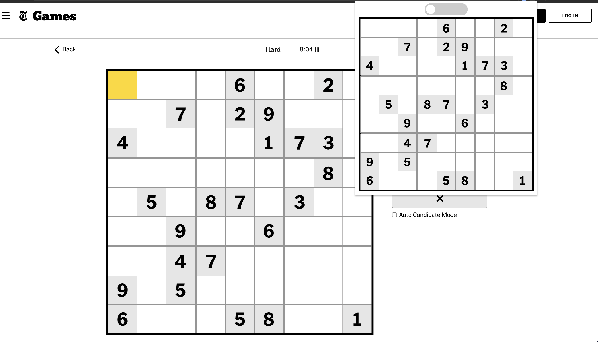
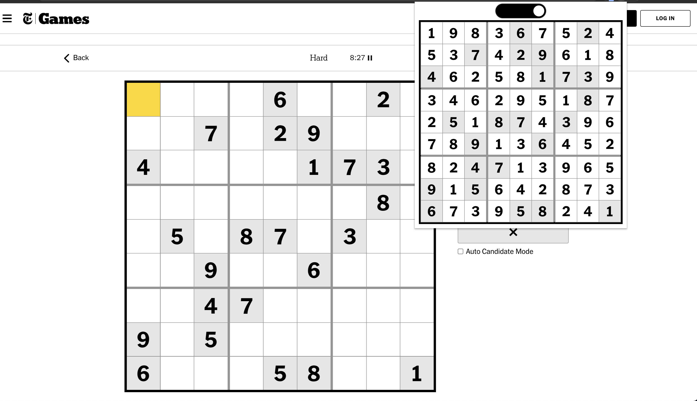

# NYTimes Sudoku Extension
An extension to solve the NYTimes Sudoku. When the extension icon is clicked, a popup displays a replica of the Sudoku grid.

    

A toggle switch toggles between the unsolved grid (above) and the solved grid (below). The Sudoku is solved using simple  backtracking.

    

